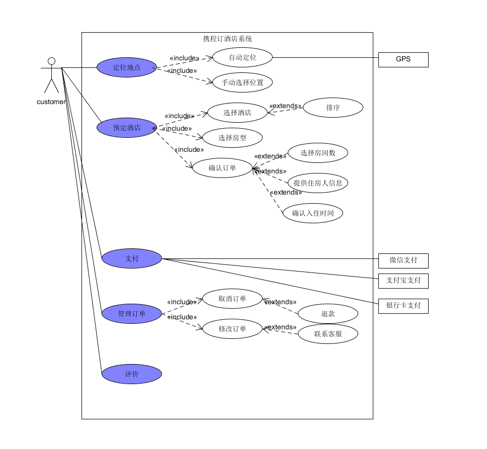
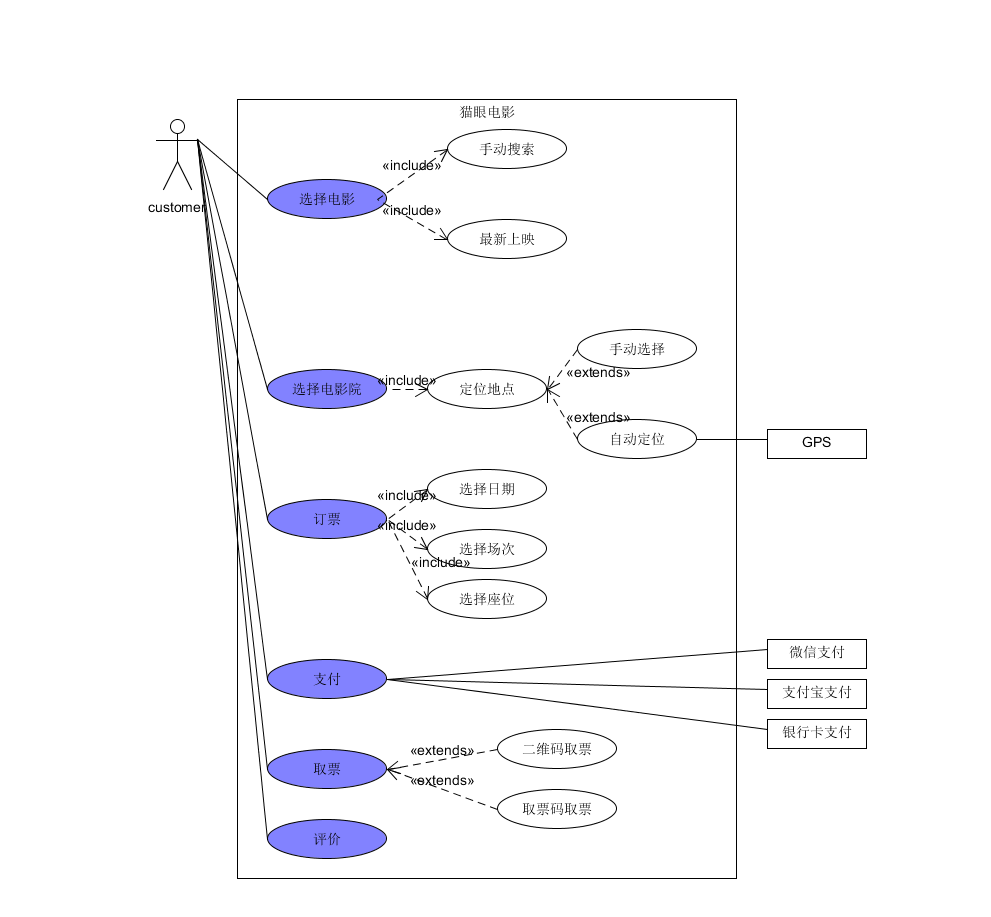

## 1.简答题

- 用例的概念

  用例是文本形式的情节描述，用以说明某参与者使用系统以实现某些目标，其本质是通过编写使用系统实现用户目标的情节来发现和记录功能性需求。

- 用例和场景的关系？什么事主场景或happy path？

  场景事参与者和系统之间的一系列特定的活动和交互，也称为用例实例；用例就是一组相关的成功和失败场景集合，用来描述参与者如何使用系统来实现其目标；主场景或happy path描述例满足涉众关注点的典型成功路径，通常不包括任何条件或分支。

- 用例有哪些形式？

  Brief（high level）、Casual（简便格式）、Fully。

- 对于复杂业务，为什么编制完整用例非常难？

  对于复杂业务，涉及的业务场景会非常繁多，且复杂，通常情况下是将整个业务拆分成不同的子业务，根据子业务分别绘制用例图；而绘制完整的用例图会使得用例图显得复杂，且绘制过程不易，对于可能有相互联系的子业务之间的处理也不会很清楚，即便能完成绘制，其他人阅读起来也是非常不便。

- 什么是用例图？

  用例图是描述用例、参与者以及它们之间关系的图，它从用户的角度来描述对信息系统的需求，分析产品的功能和行为；用例图定义和描述了系统的外部可见行为，是分析、设计直至组装测试的重要依据。

- 用例图的基本符号与元素？

  参与者：指系统以外的，在使用系统或与系统交互中所扮演的角色。

  用例：包括变量在内的一组动作序列的描述，系统执行这些动作，并产生传递特定参与则的价值的可观察结果。

  系统边界：用来表示正在建模系统的边界。

  箭头：用来表示参与者和系统通过相互发送信号或信息进行交互的关联关系，箭头尾部用来表示启动交互的一方，箭头头部用来表示被启动的一方，其中用例总是要有参与者来启动。

  关联关系；

  包含关系：把几个用例的公共步骤分离成一个单独的被包含用例。

  扩展关系：相对于包含关系一定要执行的特性，扩展关系是一种可选择执行的关系。

  泛化关系：子用例继承父用例的所有结构、行为和关系。

- 用例图的画法与步骤

  确定参与者，识别用例，确定关系，根据以上已确定的关系，使用用例图规范，绘制用例图。

- 用例图给利益相关人与开发者的价值有哪些？

  首先用例图可以方便开发人员更快更清楚的获取需求，根据需求作出初步产品之后，用例图可以指导测试，以检验产品的合格性；最关键的是它还可以在整个过程中的其他工作流起到指导作用。

## 2.建模联系

选择2-3个你熟悉的类似业务的在线服务系统，如定宾馆、定电影票、背单词App等，分别绘制它们的用例图，并满足一下要求：

- 使用用户的视角，描述用户目标或系统提供的服务
- 粒度达到子用例级别，并用include 和 extend 关联它们
- 请用彩色标注出你认为创新的用例或子用例
- 尽可能识别外部系统和服务

携程订酒店：

猫眼订票:

然后，回答下列问题：

1. 为什么相似系统的用例图是相似的？
2. 如果是定旅馆业务，请对比 Asg_RH 用例图，简述如何利用不同时代、不同地区产品的用例图，展现、突出创新业务和技术
3. 如何利用用例图定位创新思路（业务创新、或技术创新、或商业模式创新）在系统中的作用
4. 请使用 SCRUM 方法，选择一个用例图，编制某定旅馆开发的需求（backlog）开发计划表
5. 根据任务4，参考 [使用用例点估算软件成本](https://www.ibm.com/developerworks/cn/rational/edge/09/mar09/collaris_dekker/index.html)，给出项目用例点的估算

* 在相似的系统中，用户的预期目标是一样的，不用的系统需要达到用户期望的目的是一样的。

* 从技术的角度出发：当下订旅馆业务的软件，，更最求效率和速度，相比于Asg_RH用例图，当下订旅馆的无疑拥有更好的筛选系统，可以更加快速的选择自己想要的旅馆。从业务创新的角度出发：相比于传统，当下的订旅馆扩展和创新了很多业务，如增加房型，变更提供房间的方式，这些都使得用户的选择更多，用户体验更好。从时代的角度出发：当下订旅馆业务呈现多元化，并且在用户的信息保护上有了很大的突破和进展。

* 依据用例图中的每一个用例可以很清楚的知道，当前用例是其他系统所没有的，即创新点，依据创新用例在用例图中的关系和位置，可以很清楚的知道，创新用例依据的外部系统或者从属关系，很好的定位其服务方式和服务场景，发挥更好的服务效果。

   

* |  ID  |   Name   | Imp  | Est  |                         How to demo                          |                            Notes                             |
   | :--: | :------: | :--: | :--: | :----------------------------------------------------------: | :----------------------------------------------------------: |
   |  1   | 定位地点 |  9   |  4   |                   用户输入地点或者自动定位                   |                   需要使用GPS定位用户位置                    |
   |  2   | 预定酒店 |  9   |  5   | 用户选择酒店，选择房型，确认订单并选择房间数，提供入住人信息和入住时间 |                    需要针对不同的需求排序                    |
   |  3   |   支付   |  10  |  3   |                      用户支付已确认订单                      |                        支持第三方支付                        |
   |  4   | 管理订单 |  8   |  2   |                 用户可以修改订单或者取消订单                 | 修改订单需要联系客服并确定酒店能进行更换否则只能取消订单并退款 |
   |  5   |   评价   |  7   |  1   |                   入住后用户可以给酒店评价                   |                   保证评价的真实性和隐私性                   |

* |   用例   | #业务 | #计算 | 原因 | UC比重 |
   | :------: | :---: | :---: | :--: | :----: |
   | 定位地点 |   4   |   8   |      |  简单  |
   | 预定酒店 |   5   |  10   |      |  平均  |
   |   支付   |   8   |  16   | 框架 |  平均  |
   | 管理订单 |   6   |  12   |      |  平均  |
   |   评价   |   3   |   6   |      |  简单  |
